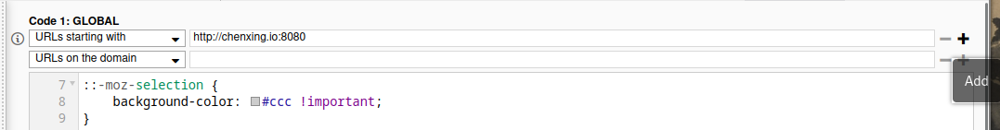

# 🔍 Searx 刑搜

## Custom Theme

1. Install the [Stylus](https://addons.mozilla.org/en-US/firefox/addon/styl-us/) Firefox addon
2. In the Preferences tab for Stylus, click `Write new style'
3. Then, click `Import`
4. Paste the content of `searx-theme.css` into the text area and click `Overwrite style`
5. Name the script `searx-theme` and `Save`. Make sure both `Enabled` and `Live preview` checkboxes are clicked

You have now successfully installed a custom theme for domain `http://chenxing.io:8080`

If you would like to apply this theme to other searx sites, simply add more rules at the top of the text area

